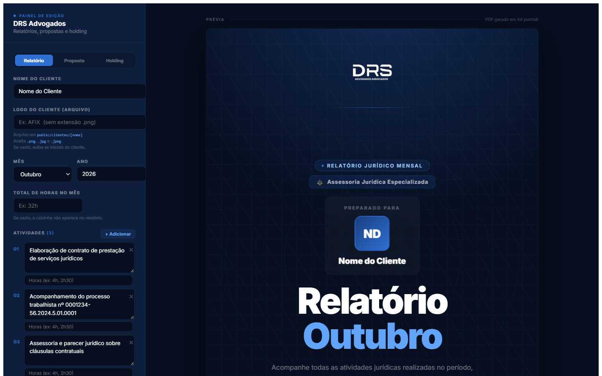

# DRS Documentos — Gerador de Relatórios e Propostas em PDF

> Painel web que gera, em poucos cliques, os documentos de cliente da **DRS Advogados Associados**: relatório jurídico mensal, proposta de honorários e apresentação de holding — todos em PDF A4 com a identidade visual do escritório.



## O que ele gera

| Documento | Para que serve | Destaques |
|---|---|---|
| **Relatório mensal** | Prestação de contas ao cliente das atividades jurídicas do mês | Capa personalizada, atividades categorizadas automaticamente, horas por atividade e total do mês |
| **Proposta de honorários** | Proposta comercial para novos serviços | Quadros de conteúdo editáveis, 5 modos de investimento (valor único, mensal, desconto à vista, à vista + parcelado, desconto + parcelado), cálculo automático de desconto, seção da equipe |
| **Apresentação de holding** | Material sobre estruturação de holding patrimonial | Explicação, vantagens, etapas do projeto em linha do tempo, equipe e contatos |

## Como funciona

1. O painel lateral (`/`) edita os campos e mostra a **prévia ao vivo** do documento.
2. Ao clicar em **Gerar PDF**, o front envia os dados para `POST /api/gerar-pdf`.
3. A API abre o **Puppeteer** (Chrome headless) na rota limpa do documento — `/relatorio`, `/proposta` ou `/holding` —, espera fontes e imagens carregarem e imprime em A4.
4. O PDF volta para o navegador já com nome padronizado, por exemplo `Relatorio-Empresa-Abril-2026.pdf` ou `Proposta-DRS-Cliente-01-10-2026.pdf`.

## Stack

- **Next.js 14** (Pages Router) + **React 18** + **TypeScript**
- **Puppeteer 22** para renderização do PDF
- **Tailwind CSS** + estilos inline para controle fino de impressão (`@page`, quebras de página)

## Como rodar

Requisitos: Node.js 18+.

```bash
git clone https://github.com/ianleaao/drs-relatorio.git
cd drs-relatorio
npm install        # também baixa o Chromium usado pelo Puppeteer
npm run dev
```

Acesse **http://localhost:3000**.

Outros comandos:

```bash
npm run typecheck  # verificação de tipos
npm run build      # build de produção
npm start          # servidor de produção
```

## Arquivos de cliente (não versionados)

Fotos da equipe e logos de clientes **não ficam no repositório** por sigilo. Coloque-os localmente nestas pastas — cada uma tem um `LEIAME.md` explicando o formato:

| Pasta | Conteúdo | Usado em |
|---|---|---|
| `public/clientes/` | Logos de clientes (`.png`, `.jpg`, `.jpeg`) | Relatório mensal |
| `public/clientes-relatorio/` | Logos de clientes | Proposta e holding |
| `public/pessoas/` | `daniel`, `douglas`, `laila` (`.jpg`/`.png`) | Seção "Nossa Equipe" |

No painel, digite só o nome do arquivo sem extensão (ex.: `EMPRESA`). Sem logo, a capa mostra as iniciais do cliente.

## Estrutura

```
drs-relatorio/
├── pages/
│   ├── index.tsx            # Painel de edição + prévia (3 abas)
│   ├── relatorio.tsx        # Rota limpa do relatório (usada pelo Puppeteer)
│   ├── proposta.tsx         # Rota limpa da proposta
│   ├── holding.tsx          # Rota limpa da holding
│   └── api/
│       ├── gerar-pdf.ts     # Gera o PDF via Puppeteer
│       └── foto-pessoa.ts   # Fotos da equipe em base64 para a prévia
├── components/
│   ├── RelatorioContent.tsx
│   ├── PropostaContent.tsx
│   ├── HoldingContent.tsx
│   └── LogoDRS.tsx
├── public/                  # Logo DRS, fundo, ícones de redes (+ pastas locais de cliente)
└── styles/globals.css
```

## Observações de deploy

O Puppeteer precisa de um ambiente com Chrome — funciona em servidor próprio, VPS ou container. Em plataformas serverless (Vercel, Netlify) é preciso trocar para `puppeteer-core` + `@sparticuz/chromium`.

---

Desenvolvido por [Ian Leão](https://github.com/ianleaao) para a DRS Advogados Associados — Brasília/DF.
